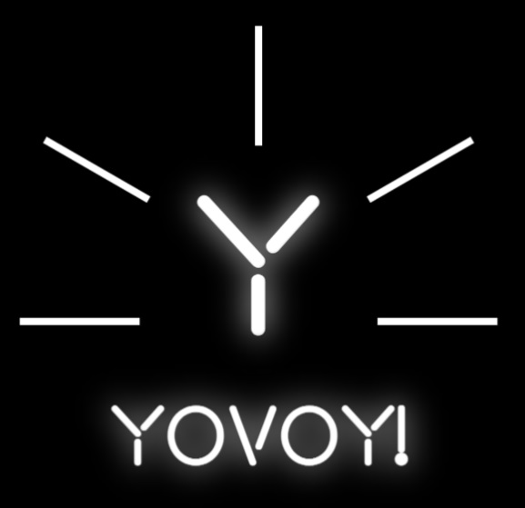

# yoVoy! - 

  

## Objetivos generales:

- Construir una App utlizando TypeScript, React, React toolkit, Redux, Node y Sequelize.
- Practicar el workflow de GIT con metodo Scrum.
- Usar y practicar testing.

## Tecnologías utilizadas:

- [ ] React
- [ ] React Toolkit
- [ ] Redux
- [ ] Express
- [ ] Sequelize - Postgres
- [ ] Json Web Token
- [ ] Bcrypt
- [ ] Nodemailer
- [ ] Mercado Pago

##### BoilerPlate:

El boilerplate cuenta con dos carpetas: `api` y `client`. En estas carpetas estará el código del back-end y el front-end respectivamente.

El contenido de `client` fue creado usando: Create React App.

##### Objetivos de la App:

Usuario:
- Comprar entradas para eventos
- Mostar informacion detallada de cada evento.
- Filtrarlos / Ordenarlos

Organizacion:
- Crear nuevos eventos
- Editar eventos (descripcion, titulo, etc)
- Controlar balance
- Mirar estadisticas de cada evento en particular

Administrador:
- Listar usuarios, compras, organizaciones.
- Banear usuarios, organizaciones malisiosas/o.
- Aceptar peticiones de organizaciones, y usuario común.

##### Intrucciones para descargar/correr el proyecto:

git clone : https://github.com/Elevattd/yoVoy-

- Dentro de la consola, ir a client/ y hacer npm install -> npm start
- Dentro de la consola, ir a api / y hacer npm install / Crear archivo .env -> npm run dev

##### Contacto:

-marianoo.14.md@gmail.com

- https://www.linkedin.com/in/mariano-dunand/
